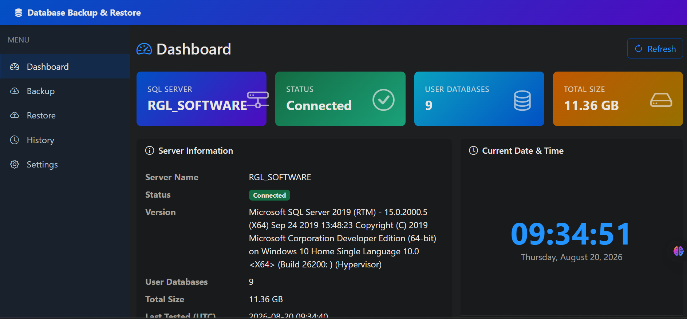
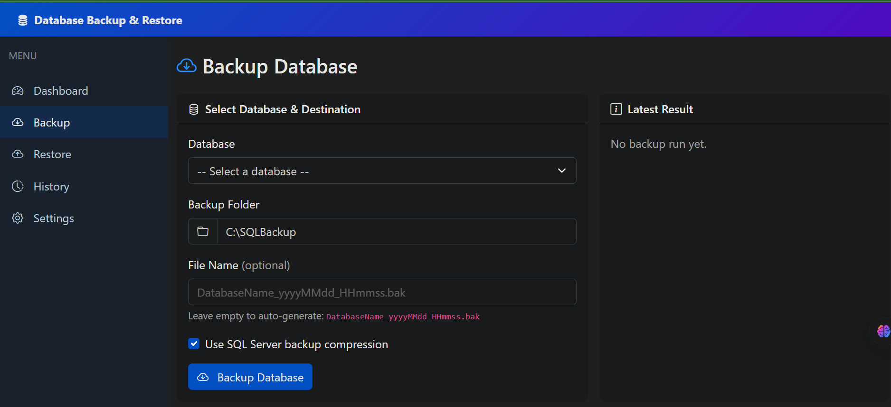
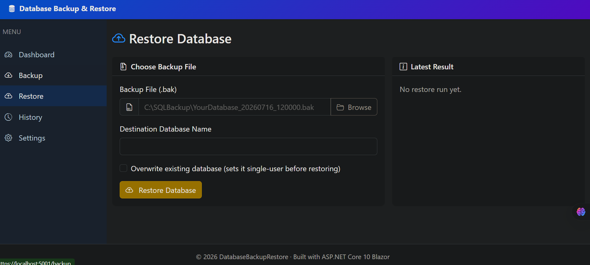
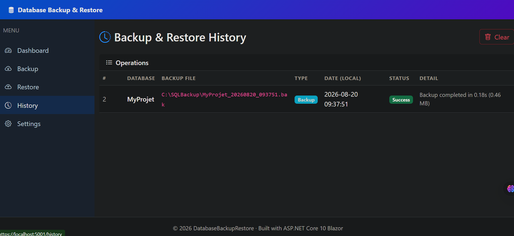
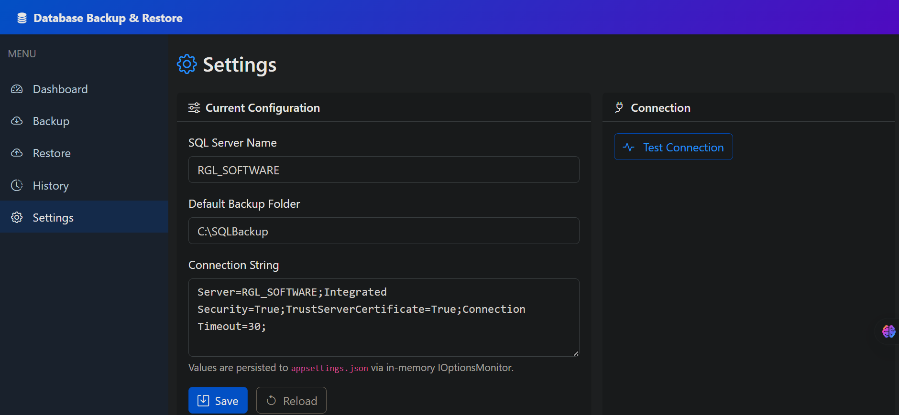

# DatabaseBackupFromBlazorFontEnd
Database backup for fontend with blazor app

First change the connetionstring with user server name on appsettings.json file.
Then run the applition and enjoy your backup and restore on your database server.

# dashboard.png
This dashboard show the connection status and how many database connected and how much memory it taken all ready.

# backup.png

# restore.png

# history.png
It show the local storage backup information.

# settings.png
You can test the connection and change the server name and connection string.

